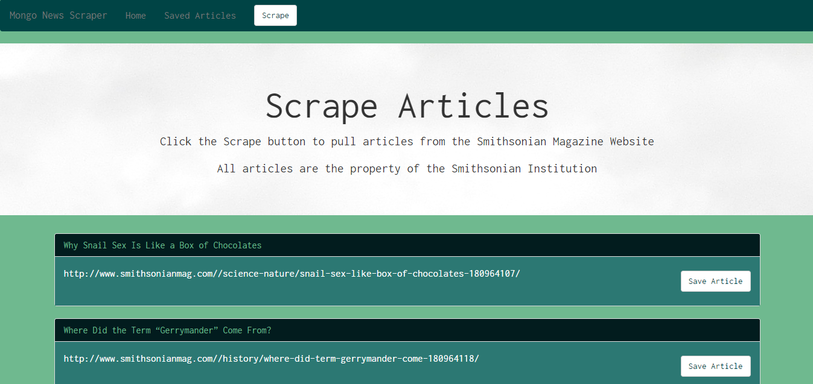
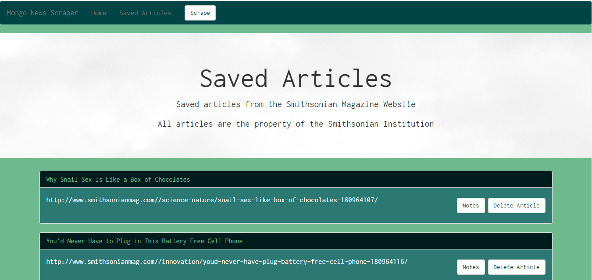

# News Scraper

This applications scrapes news articles from the Smithsonian Magazine's webpages and saves them into a MongoDB database.

The article title and links are then pulled from the database and are displayed in the brower. 

The user also has the ability to save articles that appear from the scrape. 

When the user navagates to the 'Saved Articles' page they will see all of the articles that they have decided to save. 

The user can then click on the note button to add a note about that particular article. The user can add more than one note and has the ability to delete any notes that they no longe would like to keep. 

All of these notes are saved in the database within their own collection. 

If the user decides that they no long would like to keep a saved article they can click on the delete article button and the article will be removed from their saved article page.

## Languages and Packages Used

This application uses HTML, CSS, Bootstrap, JavaScript, Node.JS, and mySQL.

The npm packages used are Mongoose, Express-Handlebars, Cheerio, Express, Morgan, Request, Body-Parser, and Method-Override.

